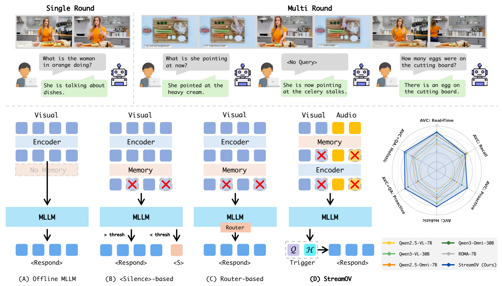
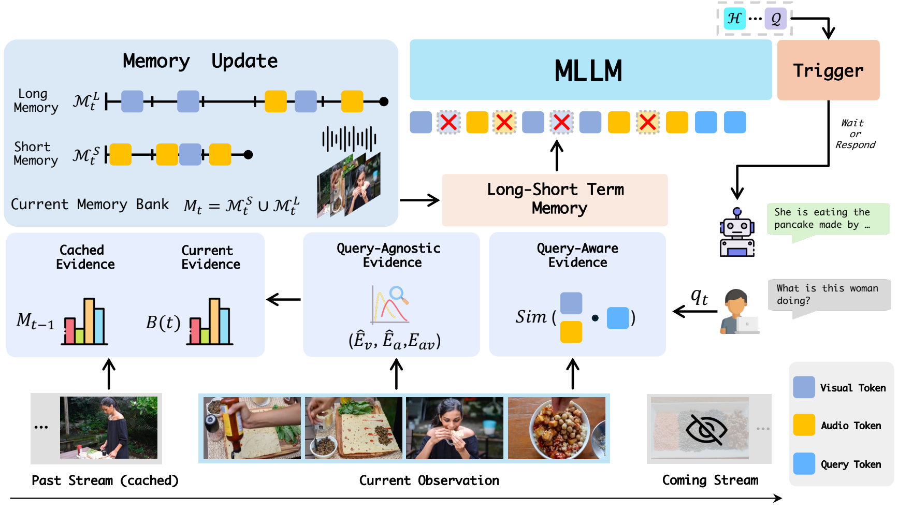
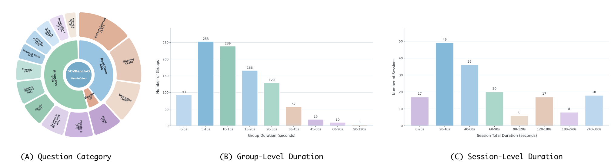

<h1 align="center">StreamOV: Streaming Omni-Video Understanding via Evidence-Guided Memory and Response Triggering</h1>

<p align="center">
  <a href="https://arxiv.org/abs/2605.25621">
    
  </a>
  <a href="https://github.com/PatrickXM/StreamOV">
    
  </a>
</p>

<div align="center">
  <strong>
    Ming Xie |
    Zizheng Huang |
    Xudong Tan |
    Chao Wang
  </strong>
  <br>
  <strong>
    Xiangyu Zeng |
    Wenxiao Wu |
    Tao Chen |
    Limin Wang |
    Yanwei Fu
  </strong>
</div>


<p align="center">
StreamOV is a streaming omni-video understanding framework for online audio-visual reasoning with bounded memory and proactive response triggering.
</p>

<p align="center">
  
</p>

## News

- **[2026/05/25]** Paper released on arXiv.
- Code, SOVBench benchmark data, evaluation scripts, and VLMEvalKit integration are on the release plan.

## Abstract

Streaming omni-video understanding requires models to continuously process synchronized visual and audio streams, preserve useful history under bounded computation, and decide when the current evidence is sufficient for a response. Existing omni-modal models are mostly designed for offline settings, and existing benchmarks rarely evaluate continuous multi-turn interaction, proactive response timing, or intentional silence. We propose **StreamOV**, a streaming omni-video understanding framework for efficient online audio-visual reasoning. StreamOV builds compact multimodal evidence from both query-agnostic stream dynamics and query-aware semantic relevance, maintains a long-short term memory under a fixed budget, and uses a hidden-state-driven trigger to decide whether to respond or wait. We also introduce **SOVBench**, a benchmark for online, multi-turn omni-video evaluation.

## Method Overview

StreamOV contains three main components:

- **Multimodal Evidence Construction:** routes streaming observations into visual-only, audio-only, and audio-visual-aligned evidence using query-agnostic dynamics and query-aware semantics.
- **Long-Short Term Memory:** keeps dense recent observations while retaining sparse, informative historical evidence under a fixed memory budget.
- **MLLM-as-a-Trigger:** probes early hidden states from the frozen omni-modal MLLM to decide whether to respond or wait, avoiding explicit silence-token generation and external routers.

<p align="center">
  
</p>

## SOVBench

We will open-source **SOVBench**, our benchmark for streaming omni-video understanding.

SOVBench has two complementary parts:

- **SOVBench-O:** online multi-round audio-visual QA for continuous comprehension, including Real-Time, Recall, and Proactive interaction paradigms.
- **SOVBench-T:** response-triggering evaluation that tests whether a model responds when evidence appears and remains silent when queried evidence is absent.

Current benchmark statistics:

| Split | Size | Focus |
| --- | ---: | --- |
| SOVBench-O | 172 sessions, 1,739 QAs, 969 dialogue groups | Multi-round online omni-video comprehension |
| SOVBench-T | 226 samples, 120 positive and 106 negative | Response triggering and intentional silence |

SOVBench-O covers 15 top-level categories and 86 fine-grained semantic categories across diverse real-world video domains.

<p align="center">
  
</p>

## Release Plan

- [ ] Release SOVBench benchmark.
- [ ] Add VLMEvalKit integration.
- [ ] Release evaluation scripts.
- [ ] Release StreamOV code.

## Citation

```bibtex
@article{xie2026streamov,
  title={StreamOV: Streaming Omni-Video Understanding via Evidence-Guided Memory and Response Triggering},
  author={Xie, Ming and Huang, Zizheng and Tan, Xudong and Wang, Chao and Zeng, Xiangyu and Wu, Wenxiao and Chen, Tao and Wang, Limin and Fu, Yanwei},
  journal={arXiv preprint arXiv:2605.25621},
  year={2026}
}
```

## Contact

For questions or suggestions, please contact: mxie24@m.fudan.edu.cn.
